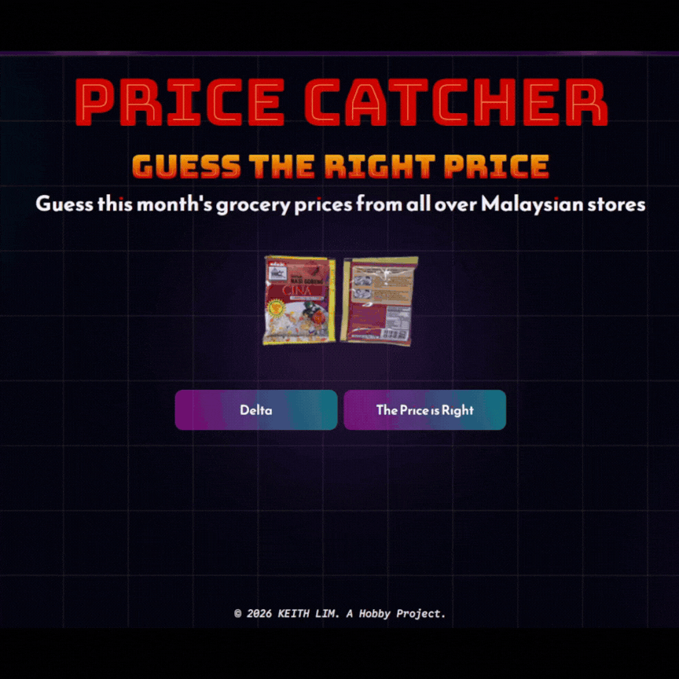

# Price Catcher

[](./LICENSE)


[](https://www.python.org)
[](https://render.com)
[](https://render.com)


Price Catcher is an interactive grocery price guessing web app built with Python language and Flask framework. It utilizes real-life data from OpenDOSM to challenge users on the daily product prices across stores in Malaysia. There are two modes in this game: Delta and The Price is Right.

Data is based on OpenDOSM's Price Catcher catalogue. Fetched using API via Python.

Deployed on Render as webservices with the hobby tier (free).<br>
<br>
[Live Demo: https://price-catcher.onrender.com](https://price-catcher.onrender.com)


## Contents

- [Features](#features)
- [Dependencies](#dependencies)
- [Installation](#installation)
- [Usage](#usage)
- [Deployment](#deployment)
- [File Structure](#file-structure)
- [References](#references)
- [License](#license)

## Features

1. **Web Deployment**: Responsive web application hosted on Render hobby tier.
2. **Dual Gamemode**: Choose between "Delta" (price difference) or "The Price is Right" (closest without going over).
3. **Data Integration**: Uses the OpenDOSM API (Price Catcher) to fetch the latest Malaysian grocery prices.

## Dependencies

- `Flask`
- `pandas`
- `pyarrow`
- `fastparquet`

## Installation

Install all libraries needed through pip.

> [!NOTE]  
> Create a virtual environment to run this project. Then activate it with git bash.

```bash
$ git clone https://github.com/bropenguin847/Price_Catcher.git
$ cd price-catcher
$ pip install -r /path/to/requirements.txt
```

## Usage

Launch app.py from terminal.

For example, here is what a typical launch would look like:

```shell
 > python app.py

 * Serving Flask app 'app'
 * Debug mode: off
WARNING: This is a development server. Do not use it in a production deployment. Use a production WSGI server instead.
 * Running on all addresses (0.0.0.0)
 * Running on http://127.0.0.1:10000
 * Running on http://10.153.254.106:10000
Press CTRL+C to quit
```

Click the link to play around!

## Deployment

This project is deployed on Render.com [here](https://price-catcher.onrender.com).

Settings (Hobby tier):

- Region: Singapore
- Instance Type: Free
- Branch: Main
- Build command: `pip install -r requirements.txt`
- Start command: `python app.py`
- Auto Deploy: On Commit

## File Structure

```shell
.
└── PRICE_CATCHER/
    ├── .venv
    ├── .gitignore
    ├── requirements.txt
    ├── static/
    │   └── styles/
    │       └── style.css
    ├── templates/
    │   ├── index.html
    │   └── pricecatcher.html
    ├── app.py
    └── game.py
```

### References

- [OpenDOSM Price Catcher](https://open.dosm.gov.my/data-catalogue/pricecatcher)
- [Lookup Premise](https://data.gov.my/data-catalogue/lookup_premise)
- [Lookup Item](https://data.gov.my/data-catalogue/lookup_item)
- [Flask sessions](https://testdriven.io/blog/flask-sessions/)
- [README template](https://github.com/alichtman/shallow-backup/blob/main/README.md)
- [Render Flask Deployoment](https://render.com/docs/deploy-flask)
- [File Tree Maker](https://tree.nathanfriend.com/)
- [w3 schools CSS Demo](https://www.w3schools.com/cssref/playdemo.php?filename=playcss_align-items)
- [ico converter](https://redketchup.io/icon-converter)
- [Creating custom badges with shields.io](https://medium.com/@samunyi90/how-to-make-custom-language-badges-for-your-profile-using-shields-io-ec69ea95dfc0)

### License


Copyright(c) 2026-present [Keith Lim](https://github.com/bropenguin847)

Licensed under the [MIT LICENSE](LICENSE)
